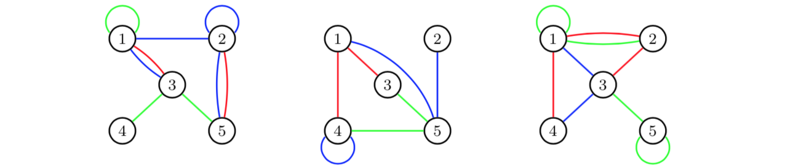
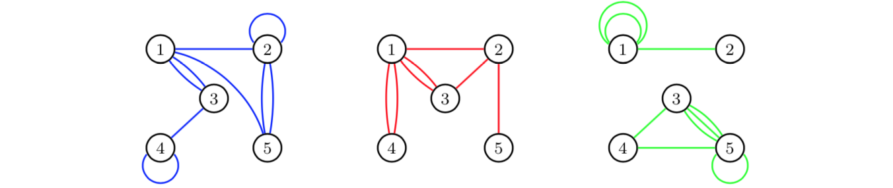
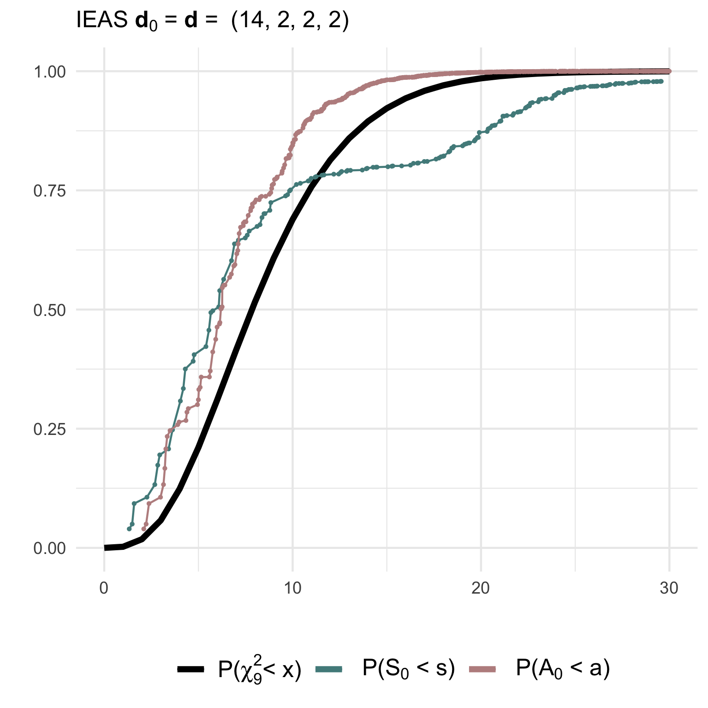
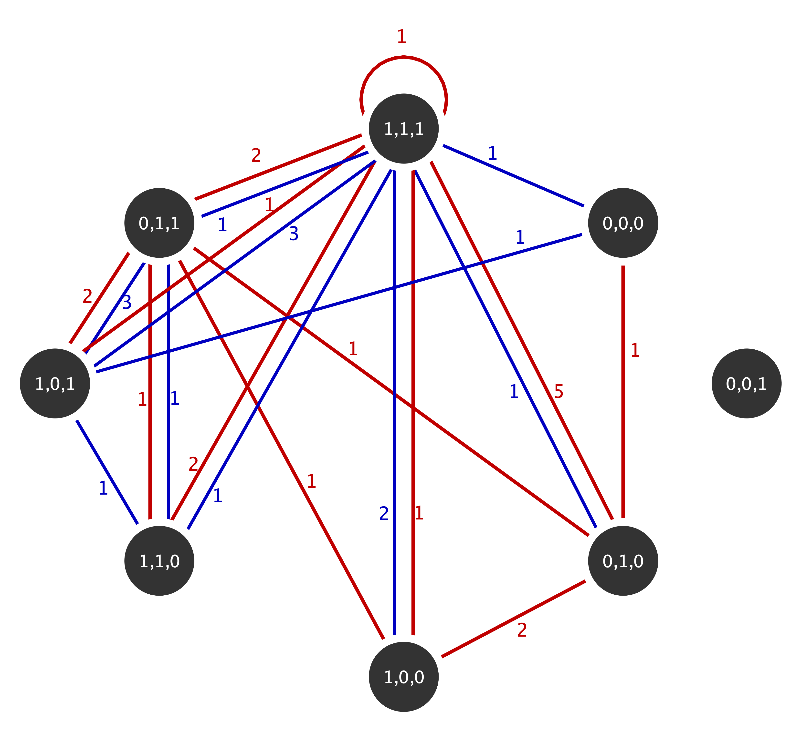

# Package overview: `multigraphr` 

[](https://cran.r-project.org/package=multigraphr)
[](https://CRAN.R-project.org/package=multigraphr)

## Installation

You can install the released version of multigraphr from
[CRAN](https://CRAN.R-project.org) with:

``` r
install.packages("multigraphr")
```

The development version from [GitHub](https://github.com/) with:

``` r
# install.packages("devtools")
devtools::install_github("termehs/multigraphr")
```

# Multigraphs and applicability

Multigraphs are network representations in which multiple edges and edge
loops (self edges) are permitted. These data structures can be either
directly observed or aggregated by classifying or cross-classifying node
attributes into meta nodes. For the latter case, within group edges
correspond to self-edges. See example below where the original graph
with 15 nodes and 12 edges (left) is aggregated based on node categories
into a small multigraph with 4 nodes (right).


Edge aggregation can also be used to obtain multigraphs. Assume that we
study a graph with three different types of relations over three periods
of time: 

If we aggregate over time periods, we obtain for each edge category a
multigraph for the total time period of three days:

 For more details on
these kinds of aggregations, see Shafie (2015;2016).

# Multigraph representation of network data

Multigraphs are represented by their edge multiplicity sequence **M**
with elements *M(i,j)*, denoting the number of edges at vertex pair
sites *(i,j)* ordered according to *(1,1) \< (1,2) \<···\< (1,n) \<
(2,2) \< (2,3) \<···\< (n,n)*, where *n* is number of nodes. The number
of vertex pair sites is given by *r = n(n+1)/2*.

## Random multigraph models

Two probability models for generating undirected random multigraphs are
implemented in the package together with several statistics under these
two models. Moreover, functions for goodness of fit tests are available
for the presented models.

Note that some of the functions are only practical for small scale
multigraphs.

The first model is obtained by random stub matching (RSM) given observed
degree sequence of a multigraphs, so that edge assignments to vertex
pair sites are dependent. The second is obtained by independent edge
assignments (IEA) according to a common probability distribution. There
are two ways in which an approximate IEA model can be obtained from an
RSM model, thus facilitating the structural analysis. These two ways
are - independent stub assignment (ISA)

- independent edge assignment of stubs (IEAS) (Shafie, 2016).

### Example

``` r
library('multigraphr')
```

Consider a small graph on 3 nodes and the following adjacency matrix:

``` r
A <-  matrix(c(1, 1, 0, 
               1, 2, 2, 
               0, 2, 0), 
             nrow = 3, ncol = 3)
A
#>      [,1] [,2] [,3]
#> [1,]    1    1    0
#> [2,]    1    2    2
#> [3,]    0    2    0
```

The degree sequence of the multigraph has double counted diagonals (edge
stubs for loops) and is given by

``` r
D <- get_degree_seq(adj = A, type = 'graph')
D
#> [1] 3 7 2
```

so that number of edges in the multigraph is half the sum of the degree
sequence which is equal to 6.

The RSM model given observed degree sequence shows the sample space
consists of 7 possible multigraphs, as represented by their multiplicity
sequence `m.seq` (each row correspond to the edge multiplicity sequence
of a unique multigraph):

``` r
rsm_1 <- rsm_model(deg.seq = D)
rsm_1$m.seq
#>   M11 M12 M22 M13 M23 M33
#> 1   1   1   0   3   0   1
#> 2   1   1   0   2   2   0
#> 3   1   0   1   3   1   0
#> 4   0   3   0   2   0   1
#> 5   0   3   0   1   2   0
#> 6   0   2   1   2   1   0
#> 7   0   1   2   3   0   0
```

with probabilities associated with each multigraph, together with
statistics ‘number of loops’, ‘number of multiple edges’ and ‘simple
graphs or not’:

``` r
rsm_1$prob.dists
#>     prob.rsm loops multiedges simple
#> 1 0.03030303     5          1      0
#> 2 0.18181818     3          3      0
#> 3 0.06060606     4          2      0
#> 4 0.06060606     3          3      0
#> 5 0.24242424     1          5      0
#> 6 0.36363636     2          4      0
#> 7 0.06060606     3          3      0
```

Consider using the IEA model to approximate the RSM model so that edge
assignment probabilities are functions of observed degree sequence. Note
that the sample space for multigraphs is much bigger than for the RSM
model so the multiplicity sequences are not printed (they can be found
using the function `get_edgemultip_seq` for very small multigraphs and
their probabilities can be found using the multinomial distribution).
The following shows the number of multigraphs under either of the IEA
models:

``` r
ieas_1 <-   iea_model(adj = A , type = 'graph',  model = 'IEAS', K = 0, apx = TRUE)
ieas_1$nr.multigraphs
#> [1] 462
```

## Statistics to analyze structural properties

These statistics include number of loops (indicator of e.g. homophily)
and number of multiple edges (indicator of
e.g. multiplexity/interlocking), which are implemented in the package
together with their probability distributions, moments and interval
estimates under the different multigraph models.

### Example (cont’d)

Under the RSM model, the first two moments and interval estimates of the
statistics *M1* = ‘number of loops’ and *M2* = ‘number of multiple
edges’ are given by

``` r
rsm_1$M
#>              M1    M2
#> Expected  2.273 3.727
#> Variance  0.986 0.986
#> Upper 95% 4.259 5.713
#> Lower 95% 0.287 1.741
```

which are calculated using the numerically found probability
distributions under RSM (no analytical solutions exist for these
moments).

Under the IEA models (IEAS or ISA), moments of these statistics,
together with the complexity statistic $R_k$ representing the sequence
of frequencies of edge sites with multiplicities *0,1,…,k*, are found
using derived formulas. Thus, there is no limit on multigraph size to
use these. When the IEAS model is used to approximate the RSM model as
shown above:

``` r
ieas_1$M
#>               M1    M2
#> Observed   3.000 3.000
#> Expected   2.273 3.727
#> Variance   1.412 1.412
#> Upper 95%  4.649 6.104
#> Lower 95% -0.104 1.351
ieas_1$R
#>              R0     R1     R2
#> Observed  2.000  2.000  2.000
#> Expected  2.674  1.588  1.030
#> Variance  0.575  1.129  0.760
#> Upper 95% 4.191  3.713  2.773
#> Lower 95% 1.156 -0.537 -0.713
```

When the ISA model is used to approximate the RSM model (see above):

``` r
isa_1 <-   iea_model(adj = A , type = 'graph',  
                     model = 'ISA', K = 0, apx = TRUE)
isa_1$M
#>              M1    M2
#> Observed  3.000 3.000
#> Expected  2.583 3.417
#> Variance  1.471 1.471
#> Upper 95% 5.009 5.842
#> Lower 95% 0.158 0.991
isa_1$R
#>              R0     R1     R2
#> Observed  2.000  2.000  2.000
#> Expected  2.599  1.703  1.018
#> Variance  0.622  1.223  0.748
#> Upper 95% 4.176  3.915  2.748
#> Lower 95% 1.021 -0.509 -0.711
```

The IEA models can also be used independent of the RSM model. For
example, the IEAS model can be used where edge assignment probabilities
are estimated using the observed edge multiplicities (maximum likelihood
estimates):

``` r
ieas_2 <-   iea_model(adj = A , type = 'graph',  
                      model = 'IEAS', K = 0, apx = FALSE)
ieas_2$M
#>              M1    M2
#> Observed  3.000 3.000
#> Expected  3.000 3.000
#> Variance  1.500 1.500
#> Upper 95% 5.449 5.449
#> Lower 95% 0.551 0.551
ieas_2$R
#>              R0     R1     R2
#> Observed  2.000  2.000  2.000
#> Expected  2.845  1.331  1.060
#> Variance  0.434  0.805  0.800
#> Upper 95% 4.163  3.125  2.849
#> Lower 95% 1.528 -0.464 -0.729
```

The ISA model can also be used independent of the RSM model. Then, a
sequence containing the stub assignment probabilities (for example based
on prior belief) should be given as argument:

``` r
isa_2 <-   iea_model(adj = A , type = 'graph',  
                     model = 'ISA', K = 0, apx = FALSE, p.seq = c(1/3, 1/3, 1/3))
isa_2$M
#>               M1    M2
#> Observed   3.000 3.000
#> Expected   2.000 4.000
#> Variance   1.333 1.333
#> Upper 95%  4.309 6.309
#> Lower 95% -0.309 1.691
isa_2$R
#>              R0     R1     R2
#> Observed  2.000  2.000  2.000
#> Expected  2.144  2.248  1.160
#> Variance  0.632  1.487  0.710
#> Upper 95% 3.734  4.687  2.845
#> Lower 95% 0.554 -0.190 -0.525
```

The interval estimates can then be visualized to detect discrepancies
between observed and expected values thus indicating social mechanisms
at play in the generation of edges, and to detect interval overlap and
potential interdependence between different types of edges (see Shafie
2015,2016; Shafie & Schoch 2021).

## Goodness of fit tests

Goodness of fits tests of multigraph models using Pearson (*S*) and
information divergence (*A*) test statistics under the random stub
matching (RSM) and by independent edge assignments (IEA) model, where
the latter is either independent edge assignments of stubs (IEAS) or
independent stub assignment (ISA). The tests are performed using
goodness-of-fit measures between the edge multiplicity sequence of a
specified model or an observed multigraph, and the expected multiplicity
sequence according to a simple or composite hypothesis.

## Simulated goodness of fit tests

Probability distributions of test statistics, summary of tests, moments
of tests statistics, adjusted test statistics, critical values,
significance level according to asymptotic distribution, and power of
tests can be examined using `gof_sim` given a specified model from which
we simulate observed values from, and a null or non-null hypothesis from
which we calculate expected values from. This in order to investigate
the behavior of the null and non-null distributions of the test
statistics and their fit to to asymptotic chi-square distributions.

### Example

Simulated goodness of fit tests for multigraphs with *n=4* nodes and
*m=10* edges.

**(1) Testing a simple IEAS hypothesis with degree sequence (6,6,6,2)
against a RSM model with degrees (8,8,2,2)**:

``` r
gof1 <- gof_sim(m = 10, model = 'IEAS', deg.mod = c(8,8,2,2), 
                hyp = 'IEAS', deg.hyp = c(6,6,6,2))
```

**(2) Testing a correctly specified simple IEAS hypothesis with degree
sequence (14,2,2,2)**:

``` r
gof2 <- gof_sim(m = 10, model = 'IEAS', deg.mod = c(14,2,2,2), 
                hyp = 'IEAS', deg.hyp = c(14,2,2,2))
```

The non-null (`gof1`) and null (`gof2`) distributions of the test
statistics together with their asymptotic chi2-distribution can be
visualised using `ggplot2`:

<div class="column">




</div>

**(3) Testing a composite IEAS hypothesis against a RSM model with
degree sequence (14,2,2,2)**:

``` r
gof3 <- gof_sim(m = 10, model = 'RSM', deg.mod = c(14,2,2,2), 
                hyp = 'IEAS', deg.hyp = 0)
```

**(4) Testing a composite ISA hypothesis against a ISA model with degree
sequence (14,2,2,2)**:

``` r
gof4 <- gof_sim(m = 10, model = 'ISA', deg.mod = c(14,2,2,2), 
                hyp = 'ISA', deg.hyp = 0)
```

The non-null (`gof3`) and null (`gof4`) distributions of the test
statistics can then be visualized as shown above to check their fit to
the asymptotic χ²-distribution.

## Performing the goodness of fit test on your data

Use function `gof_test` to test whether the observed data follows IEA
approximations of the RSM model. The null hypotheses can be simple or
composite, although the latter is not recommended for small multigraphs
as it is difficult to detect a false composite hypothesis under an RSM
model and under IEA models (this can be checked and verified using
`gof_sim` to simulate these cases).

Non-rejection of the null implies that the approximations fit the data,
thus implying that above statistics under the IEA models can be used to
further analyze the observed network. Consider the following multigraph
from the well known Florentine family network with marital. This
multigraphs is aggregated based on the three actor attributes wealth
(W), number of priorates (P) and total number of ties (T) which are all
dichotomised to reflect high or low economic, political and social
influence (details on the aggregation can be found in Shafie, 2015):

<div class="center">



</div>

The multiplicity sequence represented as an upper triangular matrix for
this mutigrpah is given by

``` r
flor_m <- t(matrix(c (0, 0, 1, 0, 0, 0, 0, 0,
                      0, 0, 0, 0, 0, 0, 0, 0,
                      0, 0, 0, 2, 0, 0, 1, 5,
                      0, 0, 0, 0, 0, 0, 1, 1,
                      0, 0, 0, 0, 0, 0, 1, 2,
                      0, 0, 0, 0, 0, 0, 2, 1,
                      0, 0, 0, 0, 0, 0, 0, 2,
                      0, 0, 0, 0, 0, 0, 0, 1), nrow= 8, ncol=8))
```

The equivalence of adjacency matrix for the multigraph is given by

``` r
flor_adj <- flor_m+t(flor_m)
flor_adj 
#>      [,1] [,2] [,3] [,4] [,5] [,6] [,7] [,8]
#> [1,]    0    0    1    0    0    0    0    0
#> [2,]    0    0    0    0    0    0    0    0
#> [3,]    1    0    0    2    0    0    1    5
#> [4,]    0    0    2    0    0    0    1    1
#> [5,]    0    0    0    0    0    0    1    2
#> [6,]    0    0    0    0    0    0    2    1
#> [7,]    0    0    1    1    1    2    0    2
#> [8,]    0    0    5    1    2    1    2    2
```

with the diagonal representing the loops double counted (Shafie, 2016).
The function `get_degree_seq` can now be used to find the degree
sequence for this multigraph:

``` r
flor_d <- get_degree_seq(adj = flor_adj, type = 'multigraph')
flor_d
#> [1]  1  0  9  4  3  3  7 13
```

Now we test whether the observed network fits the IEAS or the ISA model.
The $p$-values for testing whether there is a significant difference
between observed and expected edge multiplicity values according to the
two approximate IEA models are given in the output tables below. Note
that the asymptotic χ²-distribution has $r-1 = (n(n+1)/2) - 1 =35$
degrees of freedom.

``` r
flor_ieas_test <- gof_test(flor_adj, 'multigraph', 'IEAS', flor_d, 35)
flor_ieas_test
#>   Stat dof Stat(obs) p-value
#> 1    S  35    15.762   0.998
#> 2    A  35    18.905   0.988
```

``` r
flor_isa_test <- gof_test(flor_adj, 'multigraph', 'ISA', flor_d, 35)
flor_isa_test 
#>   Stat dof Stat(obs) p-value
#> 1    S  35    16.572   0.997
#> 2    A  35    19.648   0.983
```

The results show that we have strong evidence for the null such that we
fail to reject it. Thus, there is not a significant difference between
the observed and the expected edge multiplicity sequence according on
the two IEA models. Statistics derived under these models presented
above can thus be used to analyze the structure of these multigraphs.

## Theoretical Background

For more details regarding the theoretical background of the package,
consult the following literature which the package is based on:

> Shafie, T. (2015). A multigraph approach to social network analysis.
> *Journal of Social Structure*, 16.
> [Link](https://www.doi.org/10.21307/joss-2019-011)

> Shafie, T. (2016). Analyzing local and global properties of
> multigraphs. *The Journal of Mathematical Sociology*, 40(4), 239-264.
> [Link](https://doi.org/10.1080/0022250X.2016.1219732)

> Shafie, T., Schoch, D. (2021) Multiplexity analysis of networks using
> multigraph representations. *Statistical Methods & Applications* 30,
> 1425–1444. [Link](https://doi.org/10.1007/s10260-021-00596-0)

> Shafie, T. (2023). Goodness of fit tests for random multigraph models,
> *Journal of Applied Statistics*, 50:15, 3062-3087.
> [Link](https://doi.org/10.1080/02664763.2022.2099816)
