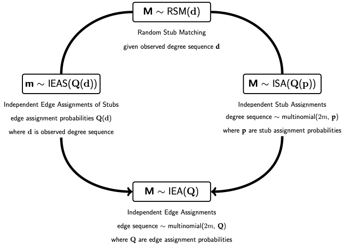
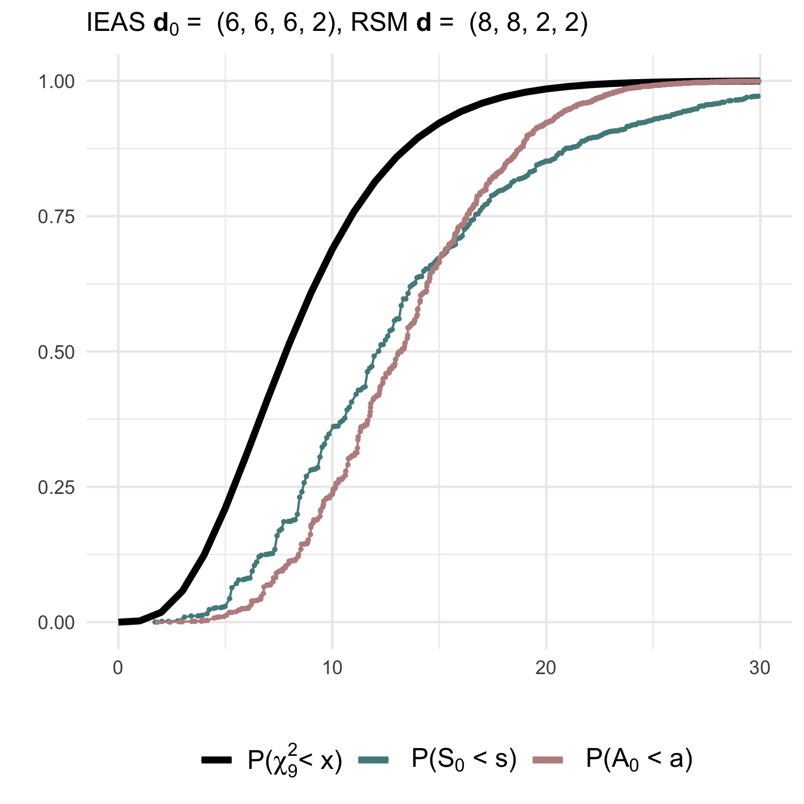
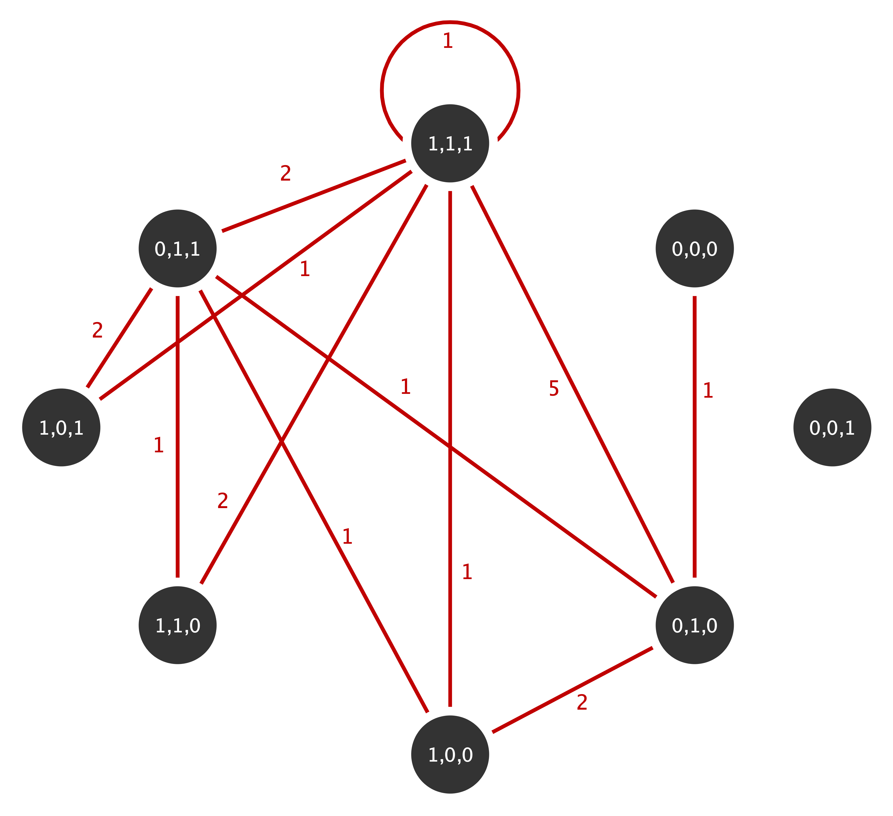

```{r, include = FALSE}
knitr::opts_chunk$set(out.width = "100%",
  cache = FALSE
)
```


This vignette serves as an introduction to the package `multigraphr`. Parts of the theoretical background is provided but for more details, consult the following literature which the package is based on:

> Shafie, T. (2015). A multigraph approach to social network analysis. *Journal of Social Structure*, 16. [Link](https://www.doi.org/10.21307/joss-2019-011)

>  Shafie, T. (2016). Analyzing local and global properties of multigraphs. *The Journal of Mathematical Sociology*, 40(4), 239-264.  [Link](https://doi.org/10.1080/0022250X.2016.1219732)

>  Shafie, T., Schoch, D. (2021) Multiplexity analysis of networks using multigraph representations. *Statistical Methods & Applications* 30, 1425–1444. 
[Link](https://doi.org/10.1007/s10260-021-00596-0)

> Shafie, T. (2023). Goodness of fit tests for random multigraph models, *Journal of Applied Statistics*, 50:15, 3062-3087. [Link](https://doi.org/10.1080/02664763.2022.2099816)


Make sure the library is loaded
```{r eval=TRUE}
library('multigraphr')
```

## Multigraphs and applicability
Multigraphs are network representations in which multiple edges and edge loops (self edges) are permitted. These data structures can be either directly observed or aggregated by classifying or cross-classifying node attributes into meta nodes. For the latter case, within group edges correspond to self-edges. See example below where the original graph with 15 nodes and 12 edges (left) is aggregated based on node categories into a small multigraph with 4 nodes (right).


Edge aggregation can also be used to obtain multigraphs. Assume that we study a graph with three different types of relations over three periods of time:


If we aggregate over time periods, we obtain for each edge category a multigraph for the total time period of three days:


     
     
For more details on these kinds of aggregations, see Shafie (2015;2016).

## Multigraph representation of network data
Multigraphs are represented by their edge multiplicity sequence $$\mathbf{M} = (M_{ij} : (i,j) \in \cal{R} )$$  where $\cal{R}$ is the canonical site space for undirected edges 
$$R =  \lbrace (i,j) : 1 \leq i \leq j \leq n \rbrace$$
i.e. $$(1,1) < (1,2) <···< (1,n) < (2,2) < (2,3) <···< (n,n)$$
where $n$ is number of nodes. 

The number of vertex pair sites is given by 
$\displaystyle r = \binom{n+1}{2}$.

Edge multiplicities can also be represented as entries in a matrix
$$\mathbf{M}=  \begin{bmatrix}
	M_{11}       & M_{12} & \dots & M_{1n} \\
	0      & M_{22} & \dots & M_{2n} \\
	\vdots & \vdots & \ddots & \vdots \\
	0      & 0& \ldots  & M_{nn}
\end{bmatrix}  \qquad 
\mathbf{M} + \mathbf{M'}=  \begin{bmatrix}
	2M_{11}       & M_{12} & \dots & M_{1n} \\
	M_{12}     & 2M_{22} & \dots & M_{2n} \\
	\vdots & \vdots & \ddots & \vdots \\
	M_{1n}     & M_{2n}  & \ldots  & 2M_{nn}
\end{bmatrix}$$
where the right hand matrix is the equivalence of an adjacency matrix of a multigraph (Shafie, 2016). 


## Random multigraph models
Two probability models for generating undirected random multigraphs are implemented in the package together with several statistics under these two models. Moreover, functions for goodness of fit tests are available for the presented models.

Note that some of the functions are only practical for small scale multigraphs (with number of nodes less than 10 and number of edges less than 20).

### Random stub matching model for multigraphs
The first model is obtained by random stub matching (RSM) given observed degree sequence of a multigraphs, so that edges are assigned to sites given fixed degree sequence  $\mathbf{d}=(d_1, \ldots, d_n)$. The edge assignment probability sequence $\mathbf{Q}$
is defined as a function of these degrees and the
edge assignment probabilities are given by
\begin{equation} Q_{ij}=  \left\{ \begin{array}{ll}
		\displaystyle \binom{d_i}{2}\bigg/ \binom{2m}{2} & \mbox{for $i=j$}\\
		\displaystyle d_id_j\bigg/ \binom{2m}{2} & \mbox{for $i<j$}
		\ , \end{array} \right  .
	 \end{equation} 
	 
The probability of a multigraph under this model is given by
\begin{equation}P(\mathbf{M}=\mathbf{m})=\frac{2^{m_2} \binom {m}{\mathbf{m}}}{\binom{2m}{\mathbf{d}}}=\frac{2^{m_2} m! \prod_{i=1}^n d_i!}{(2m)! \prod_{i\leq j} m_{ij}!} \ ,\end{equation}
where $m_2=\sum \sum_{i<j}m_{ij}$ (Shafie, 2016).

#### Example
Consider a small graph on 3 nodes and the following adjacency matrix:
```{r adj, include=TRUE, results='markup', message=FALSE}
A <-  matrix(c(1, 1, 0, 
               1, 2, 2, 
               0, 2, 0), 
             nrow = 3, ncol = 3)
A
```
The degree sequence of the multigraph has double counted diagonals (see the edge multiplciity matrix defined above) and is given by
```{r degseq, include=TRUE, results='markup', message=FALSE}
D <- get_degree_seq(adj = A, type = 'graph')
D
```
so that number of edges in the multigraph is half the sum of the degree sequence which is equal to 6.

The RSM model given this degree sequence shows that the sample space consists of 7 possible multigraphs, as represented by their multiplicity 
$$\mathbf{M}= (M_{11}, M_{12}, M_{1,3}, M_{22}, M_{23}, M_{33})$$
which is stored in data frame `m.seq` 
(each row correspond to the edge multiplicity sequence of a unique multigraph):
```{r rsm_ex1, include=TRUE, results='markup', message=FALSE}
rsm_1 <- rsm_model(deg.seq = D)
rsm_1$m.seq
```
The probabilities associated with each multigraph/edge multiplicity sequence, together with statistics 'number of loops', 'number of multiple edges' and 'simple graphs or not', are stored in `prob.dists`:
```{r rsm_ex2, include=TRUE, results='markup', message=FALSE}
rsm_1$prob.dists
```
More details on these statistics for analyzing structural properties of a multigrpahs is given below.


### Independent edge assignment model for multigraphs
The second is obtained by independent edge assignments (IEA) according to a common probability distribution. 
The $m$ edges of the multigraph are independently assigned to the sites
$(i,j)\in \mathcal{R}$ and the edge multiplicity sequence $\mathbf{M}$ follows a
multinomial distribution with parameters $m$ and $\mathbf{Q}=(Q_{ij}: (i, j) \in
\mathcal{R})$, where $\mathbf{Q}$ is the edge probability sequence with edge
assignment probabilities $Q_{ij}$ for each site $(i,j)\in \mathcal{R}$ (Shafie, 2015). The probability of a multigraph under this model is
given by
\begin{equation} P(\mathbf{M}=\mathbf{m})= \binom{m}{\mathbf{m}} \mathbf{Q}^{\mathbf{m}} = \frac{m!}{\prod_{i\leq j} m_{ij} !} \prod_{i\leq j}Q_{ij}^{m_{ij}}.
\end{equation} 
Moments of certain statistics to analyse multigraph structures are easier derived under this model, facilitating the structural analysis of the multigraphs since the full probability distribution of multigraphs is not needed. Thus, it is of interest to approximate the RSM model by the IEA model.
There are two ways in which  this can be done:

**1. Independent edge assignment of stubs (IEAS)**

In order to get an RSM approximation using the IEA model we can simply ignore the dependency between the edge assignments in the RSM model. The distribution of $\mathbf{M}$ is approximated with the edge probability sequence defined as a function of the fixed degrees $\mathbf{Q}(\mathbf{d})$.
This approximation can be viewed as repeated assignments with replacements of stubs, whereas RSM is repeated assignments without replacement of stubs. 

**2. Independent stub assignment (ISA)**

A Bayesian version of the RSM model is obtained by assigning a prior to the parameter $\mathbf{d}$, i.e., assuming that the stubs are independently attached to the $n$ nodes according to a probability distribution $\mathbf{p}=(p_1, p_2, \ldots, p_n)$ where $p_i>0$ and $\sum_{i=1}^np_i  = 1$. Thus, \mathbf{d} is the outcome of a random degree sequence that is multinomial distributed with parameters $2m$ and $\mathbf{p}=\mathbf{d}$.  Then it follows that the multiplicity sequence $\mathbf{M}$ has an IEA distribution with edge probability sequence $\mathbf{Q}(\mathbf{p})$. For the RSM approximation, $\mathbf{p}=\mathbf{d}/2m$.


The relations between the models are summarized in the below figure:

     
#### Example
The function  `iea_model` has both versions of the IEA model implemented and can be specified to approximate the RSM model.
Consider using the IEA model to approximate the RSM model so that edge assignment probabilities are functions of observed degree sequence. Note that the sample space for multigraphs is much bigger than for the RSM model so the multiplicity sequences are not printed (they can be found using the function `get_edgemultip_seq` for very small multigraphs and their probabilities can be found using the multinomial distribution). The following shows the number of multigraphs under either of the two IEA models:
```{r ieas_ex1, include=TRUE, results='markup', message=FALSE}
ieas_1 <-   iea_model(adj = A , type = 'graph',  model = 'IEAS', K = 0, apx = TRUE)
isa_1 <-   iea_model(adj = A , type = 'graph',  model = 'ISA', K = 0, apx = TRUE)
isa_1$nr.multigraphs
ieas_1$nr.multigraphs
```
The logical parameter `apx` determines whether the IEA model is being used as an approximation to the RSM model and the parameter `model` specifies which IEA model is used for the approximation. 

The IEA models can also be used independent of the RSM model. For example, the IEAS model can be used where edge assignment probabilities are estimated using the observed edge multiplicities (maximum likelihood estimates):
```{r ieas_ex3, include=TRUE, results='markup', message=FALSE}
ieas_2 <-   iea_model(adj = A , type = 'graph', model = 'IEAS', 
                      K = 0, apx = FALSE)
```
The ISA model can also be used independent of the RSM model. Then, a sequence with the stub assignment probabilities (for example based on prior belief) should be given as argument:
```{r isa_ex2, include=TRUE, results='markup', message=FALSE}
isa_2 <-   iea_model(adj = A , type = 'graph', model = 'ISA', 
                     K = 0, apx = FALSE, p.seq = c(1/3, 1/3, 1/3))
```

### Statistics to analyze structural properties
Several statistics for analyzing the structural properties of multigraphs under the different models are implemented in the package.  These include number of loops denoted $M_1$ and number of non-loops denoted $M_2$ (indicator of e.g. homophily and heterophily). Other statistics which are only implemented for the IEA model are those part of a so called complexity sequence
with the distribution of edge multiplicities. 
This sequence is given by $\mathbf{R}=(R_0, R_1, R_2, \ldots, R_m)$ where
\begin{equation}
	R_k = \sum \sum_{i<j}I(M_{ij} = k) \ \textrm{ for } \ k = 0,1, \ldots, m \ ,
\end{equation}
and $I$ is an indicator variable.
Thus, $R_0$ denotes the number of vertex pair sites with no edge occupancy,
$R_1$ single edge occupancy, $R_2$ double edge occupancy, and so forth. These statistics are useful as an indicator of e.g. multiplexity/interlocking.

Approximate 95\% interval estimates for these statistics are given by
$\hat{E} \pm 2\sqrt{\hat{V}}$.


#### Example (continued)
Under the RSM model, the first two moments and interval estimates of the statistics $M_1$  and $M_2$ are given by
```{r rsm_ex3, include=TRUE, results='markup', message=FALSE}
rsm_1$M
```
which are calculated using the numerically found probability distributions under RSM (no analytical solutions exist for these moments).

Under the IEA models (IEAS or ISA), moments of these statistics, together with the complexity statistic $R_k$ representing the sequence of
frequencies of edge sites with multiplicities $k = 0,1, \ldots, m$ are found using derived formulas. Thus, there is no limit on multigraph size. When the IEAS model is used to approximate the RSM model (see above), these statistics are:
```{r ieas_ex2, include=TRUE, results='markup', message=FALSE}
ieas_1$M
ieas_1$R
```
When the ISA model is used to approximate the RSM model (see above):
```{r isa_ex1, include=TRUE, results='markup', message=FALSE}
isa_1$M
isa_1$R
```

The interval estimates can then be visualized to detect discrepancies between observed and expected values thus indicating social mechanisms at play, and to detect interval overlap and potential interdependence between different types of edges (for examples, see Shafie 2015,2016; Shafie & Schoch 2021). 

### Goodness of fit tests
Goodness of fits tests of multigraph models using Pearson ($S$) and
information divergence ($A$) test statistics under the random stub matching (RSM)
and by independent edge assignments (IEA) model,
where the latter is either independent edge assignments of stubs (IEAS) or
independent stub assignment (ISA).
The tests are performed using goodness-of-fit measures between the
edge multiplicity sequence of a specified model or an observed multigraph,
and the expected multiplicity sequence according to a simple or composite hypothesis.

### Tests of a simple multigraph hypothesis
The following test statistics are used when edge multiplicities  according to $\textrm{IEA}(\mathbf{Q})$ and correct model $\mathbf{Q_0}=\mathbf{Q}$ is tested:

- the Pearson statistic
		$$S_0=\sum\sum_{i \leq j}\frac{(M_{ij}-mQ_{0ij})^2}{mQ_{0ij}}=\sum\sum_{i \leq j}\frac{M_{ij}^2}{mQ_{0ij}}-m \stackrel{asymp}{\sim} \chi^2(r-1)$$

		
		
		
- the divergence statistic
		$$D_0=\sum\sum_{i\leq j}\frac{M_{ij}}{m} \log \frac{M_{ij}}{mQ_{0ij}} \quad  \textrm{and} \quad A_0=\frac{2m}{\log \textrm{e}}D_0 \stackrel{asymp}{\sim} \chi^2(r-1)$$

### Tests of a composite multigraph hypothesis
The composite multigraph hypotheses are
ISA for unknown $\mathbf{p}$ 
and IEAS for unknown $\mathbf{d}$
where parameters have to be estimated from data $\mathbf{M}$.

When the correct model is tested, the statistics are given by

- the  Pearson statistic
	$$\hat{S}=\sum\sum_{i \leq j}\frac{(M_{ij}-m\hat{Q}_{ij})^2}{m\hat{Q}_{ij}}=\sum\sum_{i \leq j}\frac{M_{ij}^2}{m\hat{Q}_{ij}}-m \stackrel{asymp}{\sim} \chi^2(r-n)$$ 
	
- the divergence statistic
	$$\hat{D}=\sum\sum_{i\leq j}\frac{M_{ij}}{m} \log \frac{M_{ij}}{m\hat{Q}_{ij}} \qquad \textrm{and} \quad \hat{A}=\frac{2m}{\log \textrm{e}}\hat{D}\stackrel{asymp}{\sim} \chi^2(r-n)$$


## Simulated goodness of fit tests
Probability distributions of test statistics, summary of tests, moments of tests statistics,  adjusted test statistics, critical values, significance level according to asymptotic distribution, and power of tests can be examined using `gof_sim` given a specified model from which we simulate observed values from, and a null or non-null hypothesis from which we calculate expected values from. This in order to investigate the behavior of the null and non-null distributions of the test statistics and their fit to to asymptotic $\chi^2$ distributions, thus also checking how reliable the tests are for small sized multigraphs.

#### Example
Simulated goodness of fit tests for multigraphs with *n=4* nodes and *m=10* edges (be patient, these take a while to run).

**(1) Testing a simple IEAS hypothesis with degree sequence (6,6,6,2) against a RSM model with degrees (8,8,2,2)**:
```{r gof1, include=TRUE, results='markup', message=FALSE, eval=FALSE}
gof1 <- gof_sim(m = 10, model = 'IEAS', deg.mod = c(8,8,2,2), 
                hyp = 'IEAS', deg.hyp = c(6,6,6,2))
```

**(2) Testing a correctly specified simple IEAS hypothesis with degree sequence (14,2,2,2)**:
```{r gof2, include=TRUE, results='markup', message=FALSE, eval=FALSE}
gof2 <- gof_sim(m = 10, model = 'IEAS', deg.mod = c(14,2,2,2), 
                hyp = 'IEAS', deg.hyp = c(14,2,2,2))
```

The non-null (`gof1`) and null (`gof2`)  distributions of the test statistics together with their asymptotic chi2-distribution can be visualized using  e.g. `ggplot2`:

<div class="column">


 </div>
 
 
**(3) Testing a composite IEAS hypothesis against a RSM model with degree sequence (14,2,2,2)**:
```{r gof3, include=TRUE, results='markup', message=FALSE, eval=FALSE}
gof3 <- gof_sim(m = 10, model = 'RSM', deg.mod = c(14,2,2,2), 
                hyp = 'IEAS', deg.hyp = 0)
```

**(4) Testing a composite ISA hypothesis against a ISA model with degree sequence (14,2,2,2)**:
```{r gof4, include=TRUE, results='markup', message=FALSE, eval=FALSE}
gof4 <- gof_sim(m = 10, model = 'ISA', deg.mod = c(14,2,2,2), 
                hyp = 'ISA', deg.hyp = 0)
```

The non-null (`gof3`) and null (`gof4`)  distributions of the test statistics can then be visualized as shown above to check their fit to the asymptotic $\chi^2$-distribution.

## Performing the goodness of fit test on your data
Use function `gof_test` to test whether the observed data follows IEA approximations of the RSM model. The null hypotheses can be simple or composite, although the latter is not recommended for small multigraphs as it is difficult to detect a false composite hypothesis under an RSM model and under IEA models (this can be checked and verified using `gof_sim` to simulate these cases).

Non-rejection of the null implies that the approximations fit the data, thus implying that above statistics under the IEA models can be used to further analyze the observed network. 
Consider the following multigraph from the well known Florentine family network with  marital. This multigraphs is aggregated based on the three actor attributes wealth (W), number of priorates (P) and total number of ties (T) which are all dichotomized to reflect high or low  economic, political and social influence (details on the aggregation can be found in Shafie, 2015):
<div class="center">

 </div>
The multiplicity sequence represented as an upper triangular matrix for this mutigrpah is given by

```{r flor1, include=TRUE, results='markup', message=FALSE}
flor_m <- t(matrix(c (0, 0, 1, 0, 0, 0,	0, 0,
                      0, 0, 0, 0, 0, 0,	0, 0,
                      0, 0,	0, 2, 0, 0,	1, 5,
                      0, 0,	0, 0, 0, 0,	1, 1,
                      0, 0,	0, 0, 0, 0,	1, 2,
                      0, 0,	0, 0, 0, 0,	2, 1,
                      0, 0,	0, 0, 0, 0,	0, 2,
                      0, 0,	0, 0, 0, 0,	0, 1), nrow= 8, ncol=8))
```

The equivalence of adjacency matrix for the multigraph is given by 
```{r flor2, include=TRUE, results='markup', message=FALSE}
flor_adj <- flor_m+t(flor_m)
flor_adj 
```
with the diagonal representing the loops double counted (Shafie, 2016). The function  `get_degree_seq` can now be used to find the degree sequence for this multigraph:
```{r flor3, include=TRUE, results='markup', message=FALSE}
flor_d <- get_degree_seq(adj = flor_adj, type = 'multigraph')
flor_d
```

Now we test whether the observed network fits the IEAS or the ISA model. The $p$-values for testing whether there is a significant difference between observed and expected edge multiplicity values according to the two approximate IEA models are given in the output tables below. Note that the asymptotic $\chi^2$-distribution has $r-1 = \binom{n+1}{2} - 1 =35$ degrees of freedom.
```{r flor4, include=TRUE, results='markup', message=FALSE}
flor_ieas_test <- gof_test(flor_adj, 'multigraph', 'IEAS', flor_d, 35)
flor_ieas_test
```

```{r flor5, include=TRUE, results='markup', message=FALSE}
flor_isa_test <- gof_test(flor_adj, 'multigraph', 'ISA', flor_d, 35)
flor_isa_test 
```
The results show that we have strong evidence for the null such that we fail to reject it. Thus, there is not a significant difference between the observed and the expected edge multiplicity sequence according on the two IEA models. Statistics derived under these models presented above can thus be used to analyze the structure of these multigraphs. 


## Other functions in the package and their usage
The function `nsumk`  is useful for finding all possible degree sequences for a network with $n$ nodes and $k/2$ number of edges, or for finding all possible edge multiplicity sequence $n$ that sum up to $k$ number of edges.

#### Example
All edge multiplicity sequences/multigraph with 2 nodes and 4 edges
```{r func1, include=TRUE, results='markup', message=FALSE}
r <- (2*3)/2 # vertex pair sites (or length of edge multiplicity sequences)
mg <- nsumk(r,4) # number of rows give number of possible multigraphs
mg
```

The function `get_edge_assignment_probs` can be used to calculates the edge assignment probabilities $\mathbf{Q}$ given specified degree sequence under the two ways in which the RSM model can be approximated by the IEA model.

#### Example
Under the IEAS model with 10 possible vertex pair sites (4 nodes), the edge assignment probabilities are given by
```{r func2, include=TRUE, results='markup', message=FALSE}
Q <- get_edge_assignment_probs(m = 8, deg.seq = c(4,4,4,4), model = 'IEAS')
Q
```

Given a degree sequence, the function `get_edge_multip_seq` can be used to find all unique edge multiplicity sequences as rows in a data frame. Each row in the data frame represents a unique multigraph given the degree sequence. This is useful if you need to find the full outcome space of multgraphs under the IEA model (but only practical and readable for small multigraphs)


#### Example
To find all multigraphs with degree sequence $(4,2,2)$
```{r func3, include=TRUE, results='markup', message=FALSE}
mg <- get_edge_multip_seq(deg.seq = c(4,2,2))
mg
```

